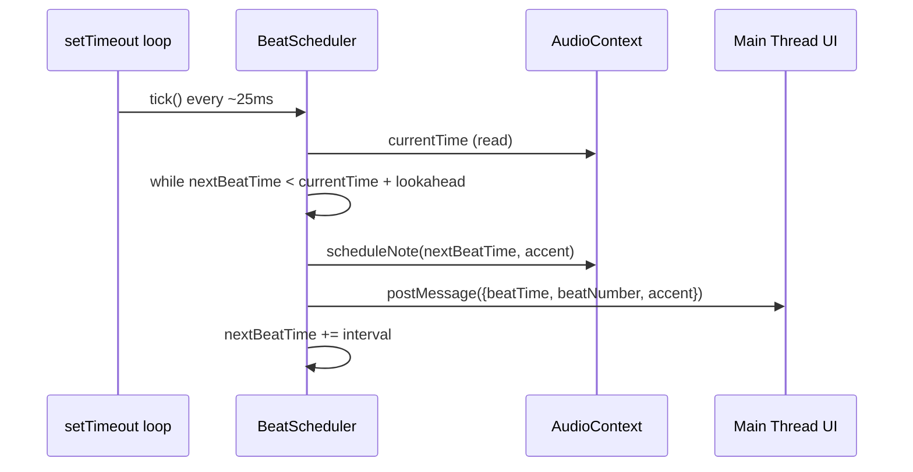

# Design Document: JS Metronome

## Overview

A browser-based metronome rebuilt from the Python/tkinter version as a **TypeScript** application, bundled with **Vite**. Run `vite build` to produce a static bundle; `vite dev` for local development. Open the built `index.html` in any modern browser and it works.

The core timing challenge is solved the same way as the Python version: a dedicated scheduler loop (not the UI event loop) drives beat generation. In the browser, `setTimeout`/`setInterval` are too jittery for musical timing, so the scheduler uses the **Web Audio API's `AudioContext.currentTime`** clock — a high-resolution, drift-free clock that runs independently of the main thread. A lookahead scheduler queues audio events slightly ahead of time, then a `setTimeout` wakes up periodically to keep the queue topped up. Visual and UI updates are dispatched back to the main thread via `postMessage` from the scheduler.

Key design goals (carried over from the Python version):
- Accurate beat timing using Web Audio API lookahead scheduling (not `setInterval`)
- Clean separation between the scheduler, audio engine, and UI layer
- No audio files — tones synthesized with `OscillatorNode` + `GainNode`
- Graceful degradation when `AudioContext` is unavailable (silent mode)


## Architecture

```mermaid
graph TD
    UI["UI Layer (HTML/CSS/TS)"]
    Scheduler["Beat Scheduler (lookahead loop)"]
    Audio["Audio Engine (Web Audio API)"]
    State["App State (plain object)"]

    UI -->|user actions: set BPM, start/stop, tap| State
    State -->|bpm, beatsPerMeasure, running| Scheduler
    Scheduler -->|scheduleNote(time, accent)| Audio
    Scheduler -->|postMessage beat event| UI
    UI -->|tap timestamps| State
```

The three layers map directly to the Python version's layers:

| Python | TypeScript |
|---|---|
| `BeatClock` (threading.Thread) | `BeatScheduler` (lookahead setTimeout loop) |
| `AudioPlayer` (pygame.mixer) | `AudioEngine` (Web Audio API OscillatorNode) |
| `MetronomeApp` (tkinter.Tk) | UI module (DOM manipulation) |
| `AppState` (dataclass) | `AppState` (TypeScript interface) |

### Lookahead Scheduling

The Web Audio API scheduler pattern works as follows:



The lookahead window is 100ms; the scheduler wakes every 25ms. This gives a 75ms safety margin — enough to absorb main-thread jank without audible glitches.


## Components and Interfaces

### BeatScheduler

Owns the lookahead scheduling loop. Runs entirely on the main thread but uses `AudioContext.currentTime` for timing, so it is immune to `setTimeout` drift.

```typescript
class BeatScheduler {
  constructor(audioEngine: IAudioEngine, onBeat: OnBeatCallback) // onBeat(beatNumber, accent, scheduledTime)
  start(): void           // resume AudioContext + begin loop
  stop(): void            // cancel next setTimeout; finish current interval
  setBpm(bpm: number): void       // takes effect on next scheduled beat
  setBeatsPerMeasure(n: number): void // takes effect at next measure boundary
  private _tick(): void   // internal: advance queue, reschedule self
}
```

- `_tick()` is called via `setTimeout(this._tick, SCHEDULE_INTERVAL_MS)`.
- Reads `this._audioCtx.currentTime` and schedules all beats that fall within `[currentTime, currentTime + LOOKAHEAD_S]`.
- Calls `audioEngine.scheduleNote(time, accent)` for each queued beat.
- Calls `onBeat(beatNumber, accent, scheduledTime)` so the UI can schedule a visual flash at the right moment (using `setTimeout(flash, (scheduledTime - audioCtx.currentTime) * 1000)`).

### AudioEngine

Wraps Web Audio API synthesis. Each tick is a short sine-wave burst created with a fresh `OscillatorNode` + `GainNode` pair (nodes are cheap and one-shot).

```typescript
interface IAudioEngine {
  scheduleNote(audioTime: number, accent: boolean): void
  resume(): Promise<void>
  close(): Promise<void>
  currentTime(): number
}

class AudioEngine implements IAudioEngine {
  constructor()                                    // creates AudioContext; throws if unavailable
  scheduleNote(audioTime: number, accent: boolean): void  // schedule a tick at audioTime
  resume(): Promise<void>                          // resume suspended AudioContext (required after user gesture)
  close(): Promise<void>                           // close AudioContext, release resources
  currentTime(): number
}

class SilentAudioEngine implements IAudioEngine {  // no-op fallback
  scheduleNote(_audioTime: number, _accent: boolean): void {}
  resume(): Promise<void> { return Promise.resolve(); }
  close(): Promise<void> { return Promise.resolve(); }
  currentTime(): number { return 0; }
}
```

Tick synthesis per beat:
- Create `OscillatorNode` (type: `"sine"`)
- Create `GainNode` with linear ramp from 1.0 → 0.0 over 20ms (fade-out envelope)
- Regular tick: 1000 Hz; Accent tick: 1500 Hz
- `oscillator.start(audioTime)` / `oscillator.stop(audioTime + 0.020)`

### TapTempo

Pure function module — no class needed. Mirrors the Python `TapTempo` exactly.

```typescript
// tapTempo.ts
const MAX_TAPS = 4;
const RESET_GAP_S = 3.0;

let _timestamps: number[] = [];

function recordTap(timestamp: number): number | null // returns BPM (integer) or null if < 2 taps
function reset(): void
```

### UI Module

Handles all DOM reads/writes. Wired up in `main.ts` after `DOMContentLoaded`.

```typescript
// ui.ts
function init(state: AppState, scheduler: BeatScheduler, tapTempo: TapTempoModule): void
function updateBpmDisplay(bpm: number): void
function setTransportState(running: boolean): void   // toggles Start/Stop button enabled states
function flashIndicator(accent: boolean): void       // flashes visual indicator; auto-resets after 100ms
function showAudioError(): void                      // displays silent-mode banner
```

### State

Typed with a TypeScript interface.

```typescript
interface AppState {
  bpm: number;             // integer, 20–300
  beatsPerMeasure: number; // integer, 1–8
  running: boolean;
  tapTimestamps: number[]; // seconds (performance.now() / 1000), up to last 4
}

const state: AppState = {
  bpm: 120,
  beatsPerMeasure: 4,
  running: false,
  tapTimestamps: [],
};
```


## Data Models

### AppState

```typescript
interface AppState {
  bpm: number;             // integer in [20, 300]
  beatsPerMeasure: number; // integer in [1, 8]
  running: boolean;
  tapTimestamps: number[]; // seconds, up to last 4
}

const BPM_MIN = 20;
const BPM_MAX = 300;

function clampBpm(value: number): number {
  return Math.max(BPM_MIN, Math.min(BPM_MAX, Math.round(value)));
}
```

### Beat Interval

```typescript
function beatInterval(bpm: number): number {
  return 60.0 / bpm; // seconds
}
```

### Accent Detection

```typescript
// beat_number is 0-indexed; beat 0 of each measure is the accent
function isAccent(beatNumber: number, beatsPerMeasure: number): boolean {
  return beatNumber % beatsPerMeasure === 0;
}
```

### Scheduler Constants

```typescript
const LOOKAHEAD_S = 0.100;        // 100ms lookahead window
const SCHEDULE_INTERVAL_MS = 25;  // wake every 25ms
const FLASH_DURATION_MS = 100;    // visual indicator on-time
```


## Algorithmic Pseudocode

### BeatScheduler._tick()

```pascal
PROCEDURE _tick()
  IF NOT running THEN RETURN END IF

  currentTime ← audioContext.currentTime

  WHILE nextBeatTime < currentTime + LOOKAHEAD_S DO
    accent ← isAccent(beatNumber, beatsPerMeasure)

    // Schedule audio (runs at exact audioTime on audio thread)
    audioEngine.scheduleNote(nextBeatTime, accent)

    // Schedule visual flash on main thread
    delayMs ← (nextBeatTime - currentTime) * 1000
    setTimeout(() → flashIndicator(accent), delayMs)

    // Notify UI (for beat counter, etc.)
    onBeat(beatNumber, accent, nextBeatTime)

    beatNumber ← beatNumber + 1

    // Apply pending time-signature change at measure boundary
    IF beatNumber % beatsPerMeasure = 0 AND pendingBeatsPerMeasure ≠ null THEN
      beatsPerMeasure ← pendingBeatsPerMeasure
      pendingBeatsPerMeasure ← null
      beatNumber ← 0
    END IF

    nextBeatTime ← nextBeatTime + (60.0 / bpm)
  END WHILE

  // Reschedule self
  _timerId ← setTimeout(_tick, SCHEDULE_INTERVAL_MS)
END PROCEDURE
```

**Preconditions:**
- `audioContext` is in `running` state (not `suspended` or `closed`)
- `bpm` is in [20, 300]
- `beatsPerMeasure` is in [1, 8]
- `nextBeatTime` is a valid `AudioContext.currentTime` value

**Postconditions:**
- All beats in `[currentTime, currentTime + LOOKAHEAD_S)` have been scheduled
- `nextBeatTime` has advanced past `currentTime + LOOKAHEAD_S`
- A new `setTimeout` is pending (unless `running` became false)

**Loop Invariant:**
- Every beat scheduled so far has `scheduledTime >= currentTime` at the moment of scheduling

---

### AudioEngine.scheduleNote()

```pascal
PROCEDURE scheduleNote(audioTime, accent)
  frequency ← IF accent THEN 1500 ELSE 1000 END IF
  duration  ← 0.020  // 20ms

  osc  ← audioContext.createOscillator()
  gain ← audioContext.createGain()

  osc.type      ← "sine"
  osc.frequency ← frequency

  // Linear fade-out envelope
  gain.gain.setValueAtTime(1.0, audioTime)
  gain.gain.linearRampToValueAtTime(0.0, audioTime + duration)

  osc.connect(gain)
  gain.connect(audioContext.destination)

  osc.start(audioTime)
  osc.stop(audioTime + duration)
  // Node auto-disconnects after stop
END PROCEDURE
```

**Preconditions:**
- `audioTime >= audioContext.currentTime` (scheduling in the past causes immediate playback, which is acceptable but not ideal)
- `audioContext.state === "running"`

**Postconditions:**
- A sine-wave tick will play at `audioTime` on the audio thread
- The oscillator node is self-cleaning (disconnects after `stop`)

---

### TapTempo.recordTap()

```pascal
FUNCTION recordTap(timestamp) → bpm | null
  // Auto-reset if gap exceeds threshold
  IF timestamps.length > 0 AND (timestamp - last(timestamps)) > RESET_GAP_S THEN
    timestamps ← []
  END IF

  timestamps.append(timestamp)

  IF timestamps.length > MAX_TAPS THEN
    timestamps ← timestamps[-MAX_TAPS:]
  END IF

  IF timestamps.length < 2 THEN
    RETURN null
  END IF

  intervals ← [timestamps[i] - timestamps[i-1] FOR i IN 1..timestamps.length-1]
  meanInterval ← sum(intervals) / intervals.length
  bpm ← round(60.0 / meanInterval)
  RETURN clampBpm(bpm)
END FUNCTION
```

**Preconditions:**
- `timestamp` is a positive float (seconds, from `performance.now() / 1000`)
- `timestamp > last(timestamps)` (taps are monotonically increasing)

**Postconditions:**
- Returns integer BPM in [20, 300] or `null`
- `timestamps` contains at most 4 entries
- If gap > 3s, prior timestamps are discarded


## Key Functions with Formal Specifications

### clampBpm(value)

```typescript
function clampBpm(value: number): number {
  return Math.max(20, Math.min(300, Math.round(value)));
}
```

**Preconditions:** `value` is a finite number  
**Postconditions:** `20 <= result <= 300`; if `value` was already in range, `result === Math.round(value)`

---

### beatInterval(bpm)

```typescript
function beatInterval(bpm: number): number { return 60.0 / bpm; }
```

**Preconditions:** `bpm` in [20, 300]  
**Postconditions:** result in [0.2, 3.0] seconds; `result * bpm === 60.0` (within float precision)

---

### isAccent(beatNumber, beatsPerMeasure)

```typescript
function isAccent(beatNumber: number, beatsPerMeasure: number): boolean {
  return beatNumber % beatsPerMeasure === 0;
}
```

**Preconditions:** `beatNumber >= 0`; `beatsPerMeasure` in [1, 8]  
**Postconditions:** returns `true` iff `beatNumber % beatsPerMeasure === 0`

---

### BeatScheduler.start()

```typescript
start(): void {
  if (this._running) return;
  this._running = true;
  this._beatNumber = 0;
  this._nextBeatTime = this._audioCtx.currentTime;
  this._audioEngine.resume();
  this._tick();
}
```

**Preconditions:** scheduler is not already running  
**Postconditions:** `_running === true`; first `_tick()` call is in progress; `_nextBeatTime` is set to `currentTime`

---

### BeatScheduler.stop()

```typescript
stop(): void {
  this._running = false;
  clearTimeout(this._timerId);
}
```

**Preconditions:** none  
**Postconditions:** `_running === false`; no further `_tick()` calls will be made; already-scheduled audio notes will still play out (Web Audio API handles this)


## Example Usage

```typescript
// main.ts — wiring everything together

const state: AppState = { bpm: 120, beatsPerMeasure: 4, running: false, tapTimestamps: [] };

let audioEngine: IAudioEngine;
try {
  audioEngine = new AudioEngine();
} catch (e) {
  audioEngine = new SilentAudioEngine();
  showAudioError();
}

const scheduler = new BeatScheduler(audioEngine, (beatNumber: number, accent: boolean, scheduledTime: number) => {
  const delayMs = (scheduledTime - audioEngine.currentTime()) * 1000;
  setTimeout(() => flashIndicator(accent), delayMs);
});

// Start
document.getElementById('btn-start')!.addEventListener('click', () => {
  scheduler.setBpm(state.bpm);
  scheduler.setBeatsPerMeasure(state.beatsPerMeasure);
  scheduler.start();
  state.running = true;
  setTransportState(true);
});

// Stop
document.getElementById('btn-stop')!.addEventListener('click', () => {
  scheduler.stop();
  state.running = false;
  setTransportState(false);
});

// BPM slider
document.getElementById('slider-bpm')!.addEventListener('input', (e: Event) => {
  state.bpm = clampBpm(Number((e.target as HTMLInputElement).value));
  updateBpmDisplay(state.bpm);
  scheduler.setBpm(state.bpm);
});

// Tap tempo
document.getElementById('btn-tap')!.addEventListener('click', () => {
  const bpm = recordTap(performance.now() / 1000);
  if (bpm !== null) {
    state.bpm = bpm;
    updateBpmDisplay(bpm);
    scheduler.setBpm(bpm);
  }
});

// Cleanup on page unload
window.addEventListener('beforeunload', () => {
  scheduler.stop();
  audioEngine.close();
});
```


## Correctness Properties

*Adapted from the Python metronome spec. Properties 1–12 map 1:1 to the same requirements.*

### Property 1: BPM clamping is always in range

For any finite number passed to `clampBpm`, the returned value is in [20, 300] inclusive. Values already in range are returned unchanged (after rounding); values below 20 return 20; values above 300 return 300.

**Validates: Requirements 1.1, 1.4, 6.4**

---

### Property 2: Beat interval matches BPM

For any BPM in [20, 300], `beatInterval(bpm) === 60.0 / bpm` (within floating-point precision), and the scheduler advances `nextBeatTime` by exactly that interval on each beat.

**Validates: Requirement 1.2**

---

### Property 3: BPM display always reflects current value

For any BPM set via the slider or tap tempo, the numeric label in the UI equals that clamped value.

**Validates: Requirement 1.3**

---

### Property 4: Transport button states are consistent with running state

For any `running` boolean, the Start button is enabled iff `running === false`, and the Stop button is enabled iff `running === true`.

**Validates: Requirements 2.3, 2.4**

---

### Property 5: Beat timing accuracy

For any BPM in [20, 300], the delta between the scheduled `audioTime` and `AudioContext.currentTime` at the moment of scheduling is less than `LOOKAHEAD_S` (100ms), and the audio note fires within the Web Audio API's scheduling precision (sub-millisecond).

**Validates: Requirement 3.1**

---

### Property 6: Accent sound frequency differs from regular tick

For any beat event, the oscillator frequency used for an accent beat (1500 Hz) differs from the frequency used for a regular beat (1000 Hz).

**Validates: Requirement 3.3**

---

### Property 7: Visual indicator flash duration is within bounds

For any beat event, the visual indicator flash duration is at least 50ms and at most 200ms. (`FLASH_DURATION_MS = 100` satisfies this.)

**Validates: Requirement 4.1**

---

### Property 8: Visual indicator accent appearance differs from regular beat

For any beat event, the CSS class or color applied to the visual indicator for an accent beat differs from that applied for a regular beat.

**Validates: Requirement 4.2**

---

### Property 9: Visual indicator is inactive when metronome is stopped

For any application state where `running === false`, the visual indicator is in its default (inactive) CSS state.

**Validates: Requirement 4.3**

---

### Property 10: Accent placement follows time signature

For any `beatsPerMeasure` N in [1, 8] and any beat number k >= 0, `isAccent(k, N) === (k % N === 0)`.

**Validates: Requirements 5.1, 5.3**

---

### Property 11: Tap tempo BPM calculation

For any sequence of 2–4 tap timestamps (monotonically increasing), the computed BPM equals `clampBpm(Math.round(60.0 / meanInterval))` where `meanInterval` is the mean of consecutive intervals.

**Validates: Requirements 6.2, 6.4**

---

### Property 12: Tap sequence resets after 3-second gap

For any tap sequence where the gap between the last tap and the next tap exceeds 3 seconds, the next tap begins a new sequence (prior timestamps discarded).

**Validates: Requirement 6.3**

## Error Handling

| Scenario | Handling |
|---|---|
| `AudioContext` unavailable (e.g. browser blocks autoplay) | Catch in `AudioEngine` constructor; substitute `SilentAudioEngine`; call `showAudioError()` to display banner |
| `AudioContext` suspended (autoplay policy) | `resume()` called on first user gesture (start/tap button click) |
| BPM out of range (slider or tap) | `clampBpm()` silently clamps; display updates to clamped value |
| Page closed while running | `beforeunload` handler calls `scheduler.stop()` then `audioEngine.close()` |
| Beat callback throws | Caught in `_tick()`; logged to `console.error`; scheduling continues |
| Time signature changed mid-measure | Stored as `pendingBeatsPerMeasure`; applied at next measure boundary |

## Testing Strategy

### Dual Testing Approach

Both unit tests and property-based tests are required and complementary.

- **Unit tests** cover specific examples, integration points, and error conditions.
- **Property tests** verify universal correctness across randomized inputs.

### Property-Based Testing

Library: **fast-check** (TypeScript), test runner: **Vitest**

Each property test uses `fc.assert(fc.property(...))` with at least 100 runs (fast-check default).

Each test is tagged with a comment referencing the design property:

```typescript
// Feature: js-metronome, Property 1: BPM clamping is always in range
test('clampBpm always returns value in [20, 300]', () => {
  fc.assert(
    fc.property(fc.integer({ min: -1000, max: 1000 }), (n: number) => {
      const result = clampBpm(n);
      return result >= 20 && result <= 300;
    }),
    { numRuns: 200 }
  );
});
```

Property-to-test mapping:

| Property | fast-check strategy |
|---|---|
| Property 1 | `fc.integer()` → `clampBpm` returns value in [20, 300] |
| Property 2 | `fc.integer({min:20, max:300})` → `beatInterval(bpm) === 60/bpm` |
| Property 3 | `fc.integer({min:20, max:300})` → BPM label text equals set value |
| Property 4 | `fc.boolean()` → button enabled states match `running` flag |
| Property 5 | `fc.integer({min:20, max:300})` → scheduled time within lookahead window |
| Property 6 | `fc.boolean()` → accent frequency (1500) !== regular frequency (1000) |
| Property 7 | Constant check → `FLASH_DURATION_MS` in [50, 200] |
| Property 8 | `fc.boolean()` → accent CSS class differs from regular class |
| Property 9 | Invariant: indicator class is default when `running === false` |
| Property 10 | `fc.integer({min:1,max:8})`, `fc.nat()` → `isAccent(k,N) === (k%N===0)` |
| Property 11 | `fc.array(fc.float({min:0.1,max:2.0}), {minLength:2,maxLength:4})` → BPM matches formula |
| Property 12 | `fc.float({min:3.001, max:10.0})` → gap > 3s resets tap sequence |

### Unit Tests

Focus areas:
- `AudioEngine` constructor throws → `SilentAudioEngine` is substituted
- `scheduler.stop()` sets `_running = false` and clears the timer
- `BeatScheduler._tick()` does not schedule beats when `running === false`
- Time signature change mid-measure applies at next measure boundary
- DOM elements (start, stop, tap, bpm-slider, time-sig selector, indicator) exist after `init()`
- `beforeunload` calls `scheduler.stop()` and `audioEngine.close()`

Run tests with: `vitest --run`

### Test File Layout

```
tests/
  test-clamp-bpm.test.ts          # Property 1
  test-beat-interval.test.ts      # Property 2
  test-bpm-display.test.ts        # Property 3
  test-transport-state.test.ts    # Property 4
  test-beat-timing.test.ts        # Property 5
  test-audio-params.test.ts       # Properties 6, 7, 8
  test-indicator-state.test.ts    # Property 9
  test-accent-placement.test.ts   # Property 10
  test-tap-tempo.test.ts          # Properties 11, 12
  test-unit-lifecycle.test.ts     # Unit: lifecycle, fallback, DOM structure
```

## File Structure

```
js-metronome/
  index.html          # Entry HTML; Vite injects the bundled script
  style.css           # Layout and visual indicator styles
  vite.config.ts      # Vite build configuration
  tsconfig.json       # TypeScript compiler options
  package.json        # npm scripts + dependencies
  src/
    state.ts          # AppState interface + clampBpm + constants
    audioEngine.ts    # IAudioEngine, AudioEngine, SilentAudioEngine
    scheduler.ts      # BeatScheduler
    tapTempo.ts       # recordTap + reset
    ui.ts             # DOM wiring + flashIndicator + setTransportState
    main.ts           # Entry point; wires all modules together
  tests/
    test-clamp-bpm.test.ts
    test-beat-interval.test.ts
    ...
```

## Performance Considerations

- Oscillator nodes are created per-beat (cheap; GC'd after `stop()`). No buffer pre-allocation needed.
- The scheduler loop wakes every 25ms — negligible CPU cost.
- Visual flashes use CSS class toggling (no layout thrash).
- `AudioContext.currentTime` is read-only and never blocks.

## Security Considerations

- No network requests; no server; no user data stored.
- `AudioContext` requires a user gesture to resume (browser autoplay policy) — handled by calling `resume()` on the first button click.

## Dependencies

- **Web Audio API** — available in all modern browsers (Chrome, Firefox, Safari, Edge). No polyfill needed.
- **Vite** — dev dependency; build tool and dev server (`vite`, `vite build`, `vite preview`).
- **TypeScript** — dev dependency; type checking and compilation (`typescript`).
- **Vitest** — dev dependency; test runner with native Vite integration (`vitest`).
- **fast-check** — dev dependency for property-based tests (`fast-check`).
- No runtime dependencies.

