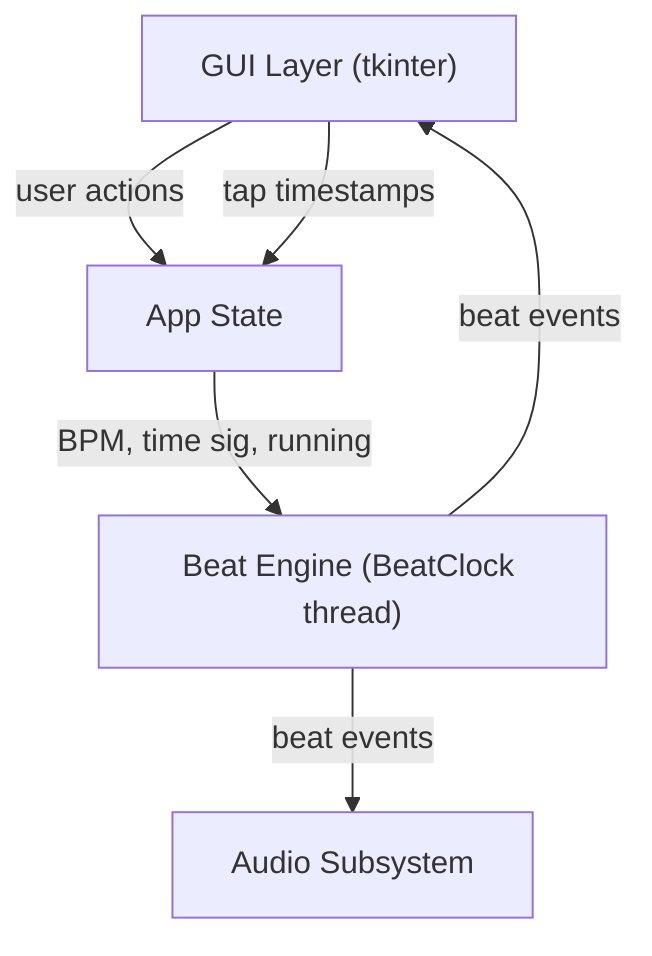

# Design Document: Python Metronome

## Overview

A standalone desktop metronome application built in Python using `tkinter` for the GUI and `pygame.mixer` (or `simpleaudio` as fallback) for audio playback. The app runs as a single-process GUI program with a background thread driving the beat clock.

Key design goals:
- Accurate beat timing using a dedicated scheduler thread (not the GUI event loop)
- Cross-platform audio with graceful degradation to silent mode
- Clean separation between the beat engine, audio subsystem, and GUI layer

## Architecture



The application has three main layers:

1. **GUI Layer** — `tkinter` widgets; handles user input and renders visual feedback. Runs on the main thread.
2. **Beat Engine** — a background `threading.Thread` that sleeps between beats and fires beat callbacks. Owns the beat counter and accent logic.
3. **Audio Subsystem** — wraps `pygame.mixer` (preferred) or `simpleaudio`; generates/plays tick sounds. Initialized at startup; falls back to no-op if unavailable.

Communication from the engine back to the GUI uses `tkinter`'s `after()` scheduling (thread-safe) to avoid direct cross-thread widget updates.

## Components and Interfaces

### BeatClock

Responsible for accurate beat scheduling.

```python
class BeatClock:
    def start(self) -> None: ...
    def stop(self) -> None: ...
    def set_bpm(self, bpm: int) -> None: ...
    def set_beats_per_measure(self, n: int) -> None: ...
    # Callback signature: on_beat(beat_number: int, is_accent: bool)
    on_beat: Callable[[int, bool], None]
```

- Runs in a daemon thread.
- Uses `time.perf_counter()` for drift-corrected sleep intervals.
- `stop()` sets a flag; the thread finishes the current sleep interval before exiting (satisfies Req 2.5).
- `set_bpm()` takes effect on the next beat interval.
- `set_beats_per_measure()` takes effect at the next measure boundary.

### AudioPlayer

Wraps audio playback; provides a no-op implementation when audio is unavailable.

```python
class AudioPlayer:
    def play_tick(self, accent: bool) -> None: ...
    def close(self) -> None: ...

class SilentAudioPlayer(AudioPlayer):
    """No-op fallback when audio device is unavailable."""
```

- Regular tick: short, lower-pitched click (~1000 Hz, ~20ms).
- Accent tick: higher-pitched click (~1500 Hz, ~20ms) or greater amplitude.
- Sounds are synthesized as numpy arrays at startup and loaded into `pygame.mixer` buffers to avoid file I/O on each beat.

### TapTempo

Stateless utility that computes BPM from a list of tap timestamps.

```python
class TapTempo:
    def record_tap(self, timestamp: float) -> Optional[int]:
        """Returns computed BPM or None if fewer than 2 taps."""
    def reset(self) -> None: ...
```

- Keeps the last four tap timestamps.
- Resets automatically if the gap since the last tap exceeds 3 seconds.
- Returns clamped BPM (20–300).

### MetronomeApp (GUI)

Top-level `tkinter.Tk` subclass that owns all widgets and wires components together.

```python
class MetronomeApp(tk.Tk):
    def __init__(self) -> None: ...
    def on_closing(self) -> None: ...  # WM_DELETE_WINDOW handler
```

Widget layout:
- BPM slider + numeric label (BPM_Control)
- Start / Stop buttons (Transport_Controls)
- Tap button
- Time signature selector (spinbox 1–8)
- Visual indicator canvas (flashes on beat)

## Data Models

### AppState

Central mutable state, accessed only from the main thread (GUI callbacks) or protected by a lock when read by BeatClock.

```python
@dataclass
class AppState:
    bpm: int = 120                  # 20–300 inclusive
    beats_per_measure: int = 4      # 1–8 inclusive
    running: bool = False
    tap_timestamps: list[float] = field(default_factory=list)
```

### BPM validation

```python
BPM_MIN = 20
BPM_MAX = 300

def clamp_bpm(value: int) -> int:
    return max(BPM_MIN, min(BPM_MAX, value))
```

### Beat interval calculation

```
interval_seconds = 60.0 / bpm
```

### Visual indicator flash timing

- Flash duration: 100ms (within the 50–200ms requirement).
- Implemented via `tkinter.after(100, reset_indicator)` scheduled on each beat callback.

### Accent detection

```python
def is_accent(beat_number: int, beats_per_measure: int) -> bool:
    return beat_number % beats_per_measure == 0
```

Beat numbers are zero-indexed; beat 0 of each measure is the accent.


## Correctness Properties

*A property is a characteristic or behavior that should hold true across all valid executions of a system — essentially, a formal statement about what the system should do. Properties serve as the bridge between human-readable specifications and machine-verifiable correctness guarantees.*

### Property 1: BPM clamping is always in range

*For any* integer input passed to `clamp_bpm`, the returned value shall be in the range [20, 300] inclusive. Values already in range are returned unchanged; values below 20 return 20; values above 300 return 300.

**Validates: Requirements 1.1, 1.4, 6.4**

---

### Property 2: Beat interval matches BPM

*For any* BPM value in [20, 300], the beat interval computed by the engine shall equal `60.0 / bpm` seconds (within floating-point precision). Changing BPM while running takes effect on the next beat.

**Validates: Requirements 1.2**

---

### Property 3: BPM label always reflects current value

*For any* BPM value set via the BPM_Control, the numeric label displayed in the GUI shall equal that value.

**Validates: Requirements 1.3**

---

### Property 4: Transport button states are consistent with running state

*For any* metronome state (running or stopped), the Start button is enabled if and only if the metronome is stopped, and the Stop button is enabled if and only if the metronome is running.

**Validates: Requirements 2.3, 2.4**

---

### Property 5: Beat timing accuracy

*For any* BPM value in [20, 300], the delta between the scheduled beat time and the actual beat callback time shall be less than 10ms, measured over a sequence of beats using a mock or high-resolution clock.

**Validates: Requirements 3.1**

---

### Property 6: Accent sound parameters differ from regular tick

*For any* beat event, the audio parameters (frequency or amplitude) used for an accent beat shall differ from those used for a regular beat.

**Validates: Requirements 3.3**

---

### Property 7: Visual indicator flash duration is within bounds

*For any* beat event, the visual indicator flash duration shall be at least 50ms and at most 200ms.

**Validates: Requirements 4.1**

---

### Property 8: Visual indicator accent appearance differs from regular beat

*For any* beat event, the color or style applied to the visual indicator for an accent beat shall differ from that applied for a regular beat.

**Validates: Requirements 4.2**

---

### Property 9: Visual indicator is inactive when metronome is stopped

*For any* application state where the metronome is not running, the visual indicator shall be in its default (inactive) appearance.

**Validates: Requirements 4.3**

---

### Property 10: Accent placement follows time signature

*For any* beats-per-measure value N in [1, 8] and any beat sequence, beat number `k` is an accent if and only if `k % N == 0`.

**Validates: Requirements 5.1, 5.3**

---

### Property 11: Tap tempo BPM calculation

*For any* sequence of two or more tap timestamps (up to four used), the computed BPM shall equal `round(60.0 / mean_interval)` clamped to [20, 300], where `mean_interval` is the average of the intervals between consecutive taps in the last four taps.

**Validates: Requirements 6.2, 6.4**

---

### Property 12: Tap sequence resets after 3-second gap

*For any* tap sequence where the gap between the last tap and the next tap exceeds 3 seconds, the next tap shall begin a new sequence (prior timestamps discarded).

**Validates: Requirements 6.3**

---

## Error Handling

| Scenario | Handling |
|---|---|
| Audio device unavailable at launch | Catch exception in `AudioPlayer.__init__`; substitute `SilentAudioPlayer`; display error label in GUI |
| BPM out of range (slider or tap) | `clamp_bpm()` silently clamps; label updates to clamped value |
| Window closed while running | `on_closing()` calls `clock.stop()` then `audio.close()` before `destroy()` |
| Beat callback raises exception | Caught in BeatClock thread; logged to stderr; beat generation continues |
| Time signature changed mid-measure | New value stored; applied at next measure boundary (beat_number resets to 0) |

## Testing Strategy

### Dual Testing Approach

Both unit tests and property-based tests are required and complementary.

- **Unit tests** cover specific examples, integration points, and error conditions.
- **Property tests** verify universal correctness across randomized inputs.

### Property-Based Testing

Library: **Hypothesis** (Python)

Each property test runs a minimum of 100 iterations (Hypothesis default is 100; set `@settings(max_examples=100)` explicitly).

Each test is tagged with a comment referencing the design property:

```python
# Feature: python-metronome, Property 1: BPM clamping is always in range
@given(st.integers())
@settings(max_examples=200)
def test_clamp_bpm_always_in_range(bpm):
    result = clamp_bpm(bpm)
    assert 20 <= result <= 300
```

Property-to-test mapping:

| Property | Test description |
|---|---|
| Property 1 | `given(integers())` → `clamp_bpm` returns value in [20, 300] |
| Property 2 | `given(integers(20, 300))` → beat interval equals `60.0 / bpm` |
| Property 3 | `given(integers(20, 300))` → BPM label text equals set value |
| Property 4 | `given(booleans())` → button enabled states match running flag |
| Property 5 | `given(integers(20, 300))` → beat delta < 10ms with mock clock |
| Property 6 | `given(booleans())` → accent audio params differ from regular |
| Property 7 | `given(...)` → flash duration in [50, 200] ms |
| Property 8 | `given(booleans())` → accent indicator color differs from regular |
| Property 9 | Invariant check: indicator default when `running=False` |
| Property 10 | `given(integers(1,8), integers(0,100))` → `is_accent(k, N) == (k % N == 0)` |
| Property 11 | `given(lists(floats(...), min_size=2, max_size=4))` → BPM matches formula |
| Property 12 | `given(floats(min_value=3.001))` → gap > 3s resets tap sequence |

### Unit Tests

Focus areas:
- `AudioPlayer` falls back to `SilentAudioPlayer` when `pygame.mixer.init()` raises
- `on_closing()` calls `clock.stop()` and `audio.close()` (mock both)
- `BeatClock.stop()` completes current interval before thread exits
- Time signature change mid-measure applies at next measure boundary
- GUI widgets (Start, Stop, Tap, time-sig selector) exist after `MetronomeApp.__init__`

### Test File Layout

```
tests/
  test_clamp_bpm.py          # Property 1
  test_beat_interval.py      # Property 2
  test_bpm_label.py          # Property 3
  test_transport_state.py    # Property 4
  test_beat_timing.py        # Property 5
  test_audio_params.py       # Properties 6, 7, 8
  test_indicator_state.py    # Property 9
  test_accent_placement.py   # Property 10
  test_tap_tempo.py          # Properties 11, 12
  test_unit_lifecycle.py     # Unit: lifecycle, fallback, widget existence
```
